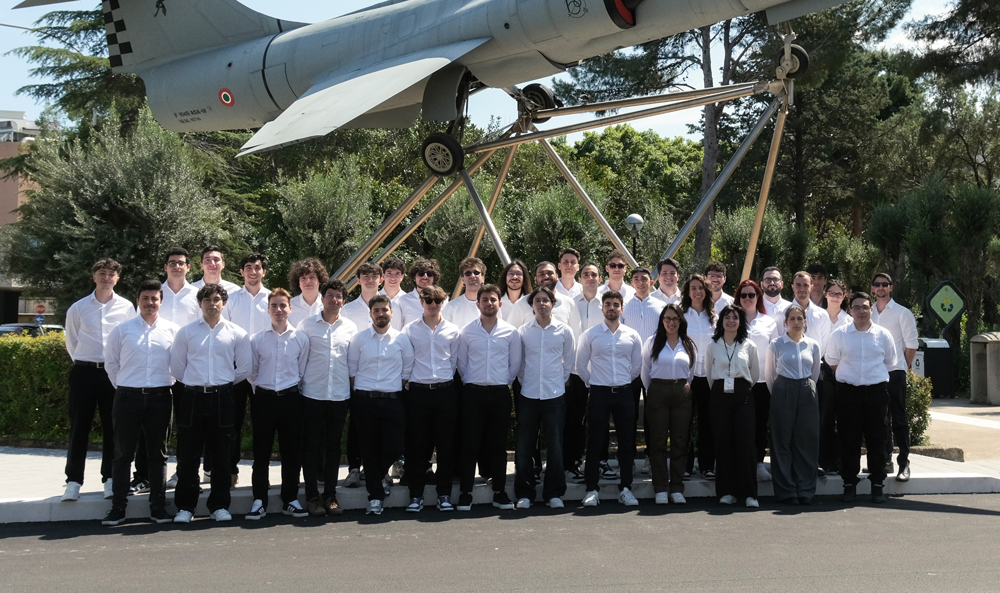

# Apex Corse

Apex Corse is the official Formula-SAE team of the University of Palermo.

Born in 2023 with the purpose of building racing cars to compete in international competitions, the team is fully composed by students of Ingeneering courses and more.

## The team

## Links

- [Github](https://github.com/Formula-SAE)
- [Instagram](https://instagram.com/apex_corse)
- [Linkedin](https://linkedin.com/company/apex-corse)